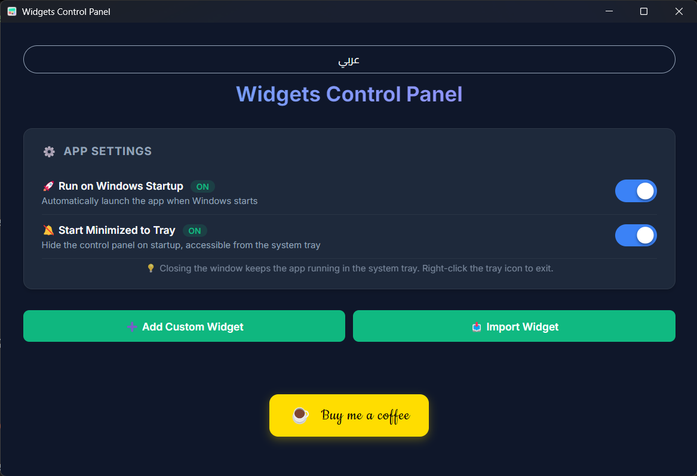
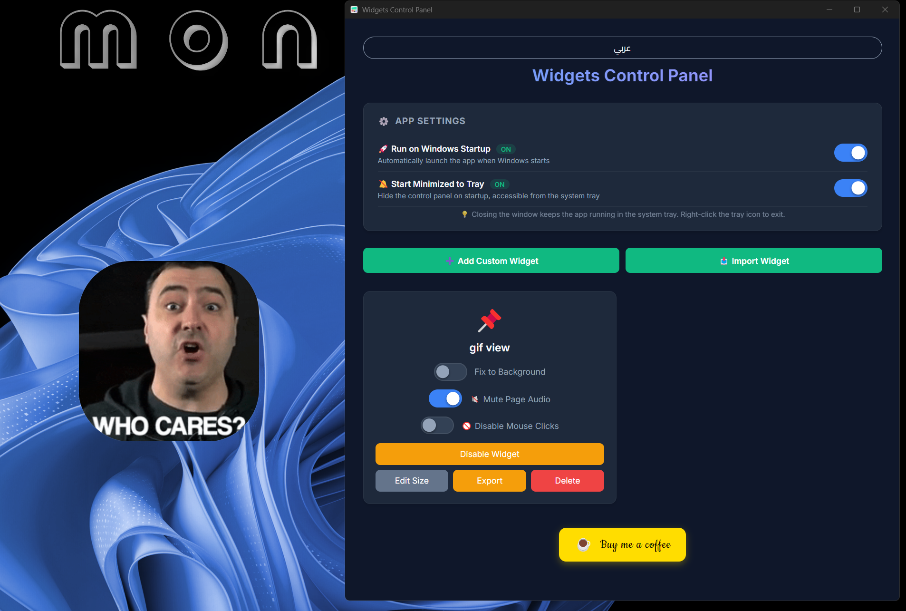

# Desktop Widgets

An open-source desktop widget manager for Windows built with **Electron**. Display any HTML page as a transparent, frameless widget pinned directly to your Windows desktop.

## Screenshots

| Control Panel | Widget in Action |
|---|---|
|  |  |

## Features

- 🖥️ Display any HTML widget on your desktop with a transparent background
- 📌 Pin widgets to the desktop background (fixed) or drag them freely
- 🔇 Mute audio per widget
- 🚫 Block mouse interaction per widget
- 🚀 Auto-launch on Windows startup
- 🔔 System Tray integration — runs silently in the background
- 📦 Export & Import widgets
- 🌐 Arabic / English UI

## Download

Download the latest version from the [Releases page](https://github.com/HxH-3mk/Desktop-Widgets/releases/latest).

## Prerequisites

- [Node.js](https://nodejs.org/) (v18 or later recommended)

## Getting Started

```bash
# 1. Clone the repository
git clone https://github.com/HxH-3mk/Desktop-Widgets.git
cd Desktop-Widgets

# 2. Install dependencies
npm install

# 3. Run in development mode
npm start
```

## Building a distributable (.exe)

```bash
npm run build
```

Output will be in the `dist/` directory.

## Creating a Widget

A widget is a single self-contained `.html` file. Guidelines:

1. Keep all CSS and JavaScript **inside** the HTML file.
2. Use `100vw` and `100vh` for full-area dimensions.
3. Do **not** use the CSS `-webkit-app-region: drag` property — the app manages dragging automatically.
4. Use `rgba()` backgrounds for transparency effects.

Once your file is ready, click **"Add Custom Widget"** in the control panel and select your `.html` file.

## Support

If you find this project useful, consider buying me a coffee ☕

[](https://buymeacoffee.com/hxh3mk)

## License

This project is open-source under the [MIT License](LICENSE).
